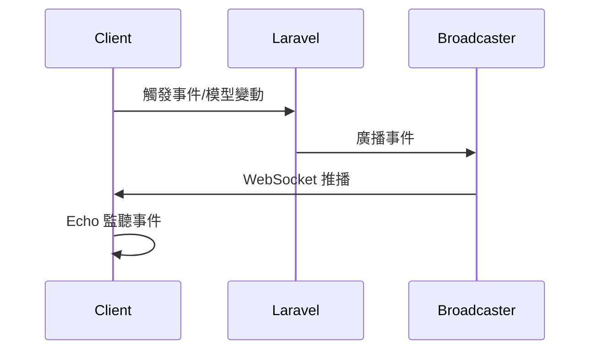

# Laravel Broadcasting & Model Broadcasting 中文筆記

---

## 1. Broadcasting 概念

- Broadcasting 讓 Laravel 事件能即時推播到前端（WebSocket、Pusher、Ably、Reverb 等）。
- 適用於聊天室、通知、即時狀態、多人協作等場景。
- 支援多種驅動：Pusher、Ably、Redis、Reverb（官方）、Log、Null。

---

## 2. 安裝與設定步驟

### 2.1 安裝套件

- Laravel 內建 broadcasting，WebSocket 建議搭配 [laravel-echo](https://laravel.com/docs/10.x/broadcasting#installing-laravel-echo) 與 [pusher-js](https://github.com/pusher/pusher-js) 或 [@ably/laravel-echo](https://github.com/ably/ably-laravel-echo)。
- Reverb（官方 WebSocket）：`composer require laravel/reverb --dev`

### 2.2 .env 設定

```env
BROADCAST_DRIVER=pusher   # 或 reverb、ably、redis
PUSHER_APP_ID=xxx
PUSHER_APP_KEY=xxx
PUSHER_APP_SECRET=xxx
PUSHER_HOST=127.0.0.1
PUSHER_PORT=6001
PUSHER_SCHEME=http
PUSHER_APP_CLUSTER=mt1
```

### 2.3 config/broadcasting.php

- 設定預設驅動、連線資訊。

---

## 3. 頻道類型

- **Public Channel**：所有人可訂閱，無需授權。
- **Private Channel**：需授權，通常與使用者/資源綁定。
- **Presence Channel**：進階 private，支援成員同步（如聊天室成員列表）。

---

## 4. 頻道授權（routes/channels.php）
```php
// 路徑：LaravelProject/routes/channels.php
// 以下是 WebSocket 頻道授權，這些不是 HTTP 路由，而是給 Broadcasting 用的頻道名稱模板：
// - order.{orderId}：訂單私人頻道，{orderId} 會被實際訂單 ID 取代，例如 order.123
//   用於推播單一訂單的狀態更新，只有有權限的用戶能訂閱。
//   前端訂閱範例：Echo.private('order.123').listen('.OrderShipmentStatusUpdated', ...);
// - presence-chat.{roomId}：聊天室 Presence Channel，{roomId} 會被實際聊天室 ID 取代，例如 presence-chat.1
//   用於聊天室成員同步與訊息推播，回傳用戶資訊給前端。
//   前端訂閱範例：Echo.join('presence-chat.1').here(...).joining(...).leaving(...);

Broadcast::channel('order.{orderId}', function ($user, $orderId) {
    return $user->canViewOrder($orderId);
});

// Presence Channel 授權 callback：
// - 如果要限制只有特定用戶能進聊天室，需在 callback 裡查詢聊天室成員名單，比對 user 是否在名單內。
// - 無成員限制 callback（直接 return 陣列）適合公開聊天室，邏輯最簡單、效能最佳。
// - 有成員名單限制 callback（查資料庫比對）適合私密聊天室或群組，授權嚴格但邏輯較複雜、效能較低。
// - 「複雜」指的是 callback 需要查資料庫、比對名單，維護與效能都較有負擔。
// - 根據聊天室需求（公開/私密/群組）選擇適合的授權方式。

// 無成員限制（所有登入用戶都能進聊天室）
Broadcast::channel('presence-chat.{roomId}', function ($user, $roomId) {
    return ['id' => $user->id, 'name' => $user->name];
});

// 有成員名單限制（只有在聊天室成員名單裡的 user 才能進）
// 假設 Room model 有 users 關聯
Broadcast::channel('presence-chat.{roomId}', function ($user, $roomId) {
    $room = Room::find($roomId);
    if ($room && $room->users->contains($user->id)) {
        return ['id' => $user->id, 'name' => $user->name];
    }
    return false; // 不在名單裡就拒絕
});
```

// 補充說明：
// 1. Private Channel（如 order.{orderId}）
//    - return true/false，代表「這個 user 是否有權限訂閱這個頻道」。
//    - true 允許訂閱，false 拒絕訂閱。
//    - 前端無法取得成員資訊，只能收到事件。
// 2. Presence Channel（如 presence-chat.{roomId}）
//    - return 陣列（array），代表「這個 user 的 Presence Channel 成員資訊」。
//    - 這個陣列會同步到前端 Echo，作為聊天室成員列表資料。
//    - return false 或 null 則拒絕訂閱。
//    - 前端可取得所有成員的 return 陣列：
//      Echo.join('presence-chat.1')
//        .here(users => { /* users 是所有 return 的陣列 */ })
//        .joining(user => { /* user 是新加入者的 return 陣列 */ })
//        .leaving(user => { /* user 是離開者的 return 陣列 */ });

// 更白話說明：
// - 無成員限制 callback 就像「開放式咖啡廳」，只要你走進來，老闆就把你名字寫在白板上，大家都能看到你在這裡。
// - 有成員名單限制 callback 就像「私人俱樂部」，門口有名單，只有名單上的人才能進來，進來後才會把你名字寫在白板上。
// - 有成員名單限制比較複雜，因為每次有人要進來都要查一次名單（查資料庫），多了一層判斷。
// - 不管哪種寫法，只要 callback return 陣列，Echo 會自動把所有 return 的人組成成員列表給前端，不用自己維護。
```

---

## 5. 事件定義與廣播

### 5.1 手動事件

```php
// 路徑：LaravelProject/app/Events/OrderShipmentStatusUpdated.php
use Illuminate\Broadcasting\InteractsWithSockets;
use Illuminate\Contracts\Broadcasting\ShouldBroadcast;

class OrderShipmentStatusUpdated implements ShouldBroadcast
{
    use InteractsWithSockets;

    public $order;

    public function __construct($order)
    {
        $this->order = $order;
    }

    public function broadcastOn()
    {
        return new PrivateChannel('order.'.$this->order->id);
    }

    // 進階：自訂事件名稱
    public function broadcastAs()
    {
        return 'order.shipment.updated';
    }

    // 進階：自訂 payload
    public function broadcastWith()
    {
        return ['status' => $this->order->status];
    }
}
```

### 5.2 Model Broadcasting（自動）

```php
// 路徑：LaravelProject/app/Models/Message.php
class Message extends Model
{
    use BroadcastsEvents;

    public function broadcastOn(string $event): array
    {
        return [new PrivateChannel('chat.'.$this->room_id)];
    }
}
```

---

## 6. 前端 Echo 實作

### 6.1 安裝

```bash
npm install --save laravel-echo pusher-js
```

### 6.2 初始化

```js
// 路徑：LaravelProject/resources/js/components/ChatRoom.js
import Echo from "laravel-echo";
window.Pusher = require('pusher-js');

window.Echo = new Echo({
    broadcaster: 'pusher',
    key: 'xxx',
    cluster: 'mt1',
    forceTLS: false,
    wsHost: window.location.hostname,
    wsPort: 6001,
    disableStats: true,
    // authEndpoint: '/broadcasting/auth', // 若有自訂
});
```

### 6.3 監聽事件

```js
// 路徑：LaravelProject/resources/js/components/ChatRoom.js
// Private channel
Echo.private(`order.${orderId}`)
    .listen('.OrderShipmentStatusUpdated', (e) => {
        console.log(e.status);
    });

// Model Broadcasting
Echo.private(`App.Models.User.${userId}`)
    .listen('.UserUpdated', (e) => {
        console.log(e.model);
    });

// Presence channel
Echo.join(`presence-chat.${roomId}`)
    .here((users) => { // 一進聊天室時，取得目前所有在線成員的陣列
        // users 例如：[{ id: 1, name: '小明' }, { id: 2, name: '阿美' }]
        setMembers(users); // React 寫法：設定成員列表
        // this.members = users; // Vue 寫法：設定成員列表
    })
    .joining((user) => { // 有新成員加入聊天室時觸發
        // user 例如：{ id: 3, name: 'Vincent' }
        setMembers(members => [...members, user]); // React 寫法：把新成員加進列表
        // this.members.push(user); // Vue 寫法
    })
    .leaving((user) => { // 有成員離開聊天室時觸發
        // user 例如：{ id: 2, name: '阿美' }
        setMembers(members => members.filter(u => u.id !== user.id)); // React 寫法：移除離開的成員
        // this.members = this.members.filter(u => u.id !== user.id); // Vue 寫法
    })
    .listen('.MessageCreated', (e) => { // 監聽新訊息事件
        // e.model 就是新訊息資料
        setMessages(msgs => [...msgs, e.model]); // React 寫法：把新訊息加到訊息列表
        // this.messages.push(e.model); // Vue 寫法
    });
```

### 6.4 React/Vue Hook

```js
// 路徑：LaravelProject/resources/js/components/ChatRoom.js

import { useEchoModel } from "@laravel/echo-react";

useEchoModel("App.Models.User", userId, ["UserUpdated"], (e) => {
    console.log(e.model);
});
```

---

## 7. Client Events（Whisper）

- 用於「正在輸入」等 UI 狀態同步，不經過後端。

```js
// 路徑：LaravelProject/resources/js/components/ChatRoom.js

Echo.private(`chat.${roomId}`)
    .whisper('typing', { name: this.user.name });

Echo.private(`chat.${roomId}`)
    .listenForWhisper('typing', (e) => {
        console.log(e.name);
    });
```

---

## 8. Notification 廣播

- 設定 Notification 使用 broadcast channel
- 前端監聽

```js
// 路徑：LaravelProject/resources/js/components/ChatRoom.js

Echo.private(`App.Models.User.${userId}`)
    .notification((notification) => {
        console.log(notification.type);
    });
```

---

## 9. Broadcasting 生命週期流程圖



---

## 10. 進階用法

- **ShouldQueue**：事件可 queue，避免阻塞請求。
- **ShouldBroadcastNow**：立即廣播，不進 queue。
- **ShouldBroadcastAfterCommit**：資料庫 commit 後才廣播。
- **toOthers()**：只推播給其他人。
- **via/broadcastVia**：自訂廣播驅動。
- **多連線/匿名事件/ShouldRescue**：可參考官方文件進階章節。

---

## 11. Q&A 與常見問題

- Q: Broadcasting 與 Event Listener 差異？
  - A: Listener 處理後端業務邏輯，Broadcasting 推播給前端。
- Q: Model Broadcasting 會自動廣播哪些事件？
  - A: created、updated、deleted、trashed、restored。
- Q: 如何只針對特定事件廣播？
  - A: 在 broadcastOn 依 $event 判斷回傳頻道或空陣列。
- Q: 前端事件名稱要加點（.）嗎？
  - A: 是，需 listen('.EventName', ...)。
- Q: 如何避免自己收到自己的廣播？
  - A: 使用 dontBroadcastToCurrentUser()。
- Q: Presence channel 如何同步成員？
  - A: Echo.join().here()、joining()、leaving()。
- Q: 如何 queue 廣播事件？
  - A: 事件實作 ShouldQueue。
- Q: 如何自訂事件名稱與 payload？
  - A: 實作 broadcastAs、broadcastWith。
- Q: 如何取得 Model 廣播頻道名稱？
  - A: $model->broadcastChannel()。

---

## 12. 實作範例：聊天室訊息同步

### Model

```php
// 路徑：LaravelProject/app/Models/Message.php
class Message extends Model
{
    use BroadcastsEvents;

    public function broadcastOn(string $event): array
    {
        return [new PrivateChannel('chat.'.$this->room_id)];
    }
}
```

### 前端

```js
// 路徑：LaravelProject/resources/js/components/ChatRoom.js

Echo.private(`chat.${roomId}`)
    .listen('.MessageCreated', (e) => {
        // 新訊息同步
    });
```

---

## 13. Presence Channel 成員同步

### routes/channels.php

```php
// 路徑：LaravelProject/routes/channels.php

Broadcast::channel('presence-chat.{roomId}', function ($user, $roomId) {
    return ['id' => $user->id, 'name' => $user->name];
});
```

### 前端

```js
// 路徑：LaravelProject/resources/js/components/ChatRoom.js

Echo.join(`presence-chat.${roomId}`)
    .here((users) => { /* 初始成員列表 */ })
    .joining((user) => { /* 有人加入 */ })
    .leaving((user) => { /* 有人離開 */ })
    .listen('.MessageCreated', (e) => { /* 新訊息 */ });
```

---

## 14. Broadcasting 與 Model Broadcasting 差異

| 類型                | 用途                         | 需自訂 Event 類別 | 適用場景           |
|---------------------|------------------------------|-------------------|--------------------|
| Broadcasting        | 任意事件推播                 | 需要              | 複雜業務/通知      |
| Model Broadcasting  | 模型 CRUD 自動推播           | 不需要            | 即時同步/聊天室    |

---

如需自動產生範例檔案、Controller、Job、前端元件等，請告知具體需求（如聊天室、訂單狀態等），可一條龍補全。
如需補充更多 Q&A 或進階註解，請隨時提出！

---

## 如何分辨 Private Channel 與 Presence Channel？

| 頻道類型         | 頻道名稱範例           | 前端訂閱方式           | callback return 型態 | 用途/特徵                  |
|------------------|------------------------|------------------------|---------------------|-----------------------------|
| Private Channel  | order.{orderId}        | Echo.private(...)      | true/false          | 單人/授權，無成員列表       |
| Presence Channel | presence-chat.{roomId} | Echo.join(...)         | 陣列（成員資訊）     | 多人/成員同步/有成員列表    |

判斷訣竅：
- callback return true/false 幾乎都是 Private Channel。
- callback return 陣列（array）幾乎都是 Presence Channel。
- 前端用 Echo.private(...) 就是 Private，用 Echo.join(...) 就是 Presence。
- Presence Channel 支援 here/joining/leaving 成員同步，Private Channel 沒有。

---

## Public Channel、Private Channel、Presence Channel 差異與 broadcastOn() 範例

| 頻道類型         | broadcastOn() 實例             | 前端訂閱方式           | 授權 | 用途/特徵                  |
|------------------|-------------------------------|------------------------|------|-----------------------------|
| Public Channel   | new Channel('news')           | Echo.channel(...)      | 否   | 所有人可訂閱               |
| Private Channel  | new PrivateChannel('orders.1')| Echo.private(...)      | 是   | 需授權，單人/私有           |
| Presence Channel | new PresenceChannel('chat.1') | Echo.join(...)         | 是   | 需授權，支援成員同步         |

### broadcastOn() 範例

```php
// Public Channel 範例
// 路徑：LaravelProject/app/Events/PublicNewsPosted.php
use Illuminate\Broadcasting\Channel;
use Illuminate\Contracts\Broadcasting\ShouldBroadcast;

class PublicNewsPosted implements ShouldBroadcast
{
    public function broadcastOn()
    {
        return new Channel('public-news');
    }
}
```

```php
// Private Channel 範例
// 路徑：LaravelProject/app/Events/OrderShipmentStatusUpdated.php
use Illuminate\Broadcasting\PrivateChannel;
use Illuminate\Contracts\Broadcasting\ShouldBroadcast;

class OrderShipmentStatusUpdated implements ShouldBroadcast
{
    public $order;
    public function __construct($order) { $this->order = $order; }
    public function broadcastOn()
    {
        return new PrivateChannel('orders.' . $this->order->id);
    }
}
```

```php
// Presence Channel 範例
// 路徑：LaravelProject/app/Events/ChatMessageSent.php
use Illuminate\Broadcasting\PresenceChannel;
use Illuminate\Contracts\Broadcasting\ShouldBroadcast;

class ChatMessageSent implements ShouldBroadcast
{
    public $roomId;
    public function __construct($roomId) { $this->roomId = $roomId; }
    public function broadcastOn()
    {
        return new PresenceChannel('chat.' . $this->roomId);
    }
}
```

#### Q&A
- Q: Public Channel 可以直接回傳字串嗎？
  - A: 可以，等同於 new Channel('xxx')。
- Q: Private/Presence Channel 一定要 new 嗎？
  - A: 建議用 new PrivateChannel/PresenceChannel，Laravel 會自動辨識授權。
- Q: 可以同時回傳多個頻道嗎？
  - A: 可以，回傳陣列即可，例如：
    ```php
    return [
        new PrivateChannel('orders.' . $this->order->id),
        new Channel('public-news')
    ];
    ```
- Q: 前端如何訂閱？
  - A: Public 用 Echo.channel，Private 用 Echo.private，Presence 用 Echo.join。 

---

## 聊天室即時推播運作流程

1. **用戶在聊天室輸入訊息並送出**
   - 前端呼叫 API，將訊息傳給後端
   ```js
   // 路徑：LaravelProject/resources/js/components/ChatRoom.js
   axios.post('/api/chat/1/messages', { content: '哈囉大家好' });
   ```
2. **後端儲存訊息到資料庫，並廣播事件**
   ```php
   // 路徑：LaravelProject/app/Http/Controllers/ChatController.php
   public function store(Request $request, $roomId)
   {
       $message = Message::create([
           'room_id' => $roomId,
           'user_id' => Auth::id(),
           'content' => $request->input('content'),
       ]);
       // 廣播事件（自動 Model Broadcasting 或自訂事件）
       return $message->load('user');
   }
   ```
3. **Laravel 廣播事件到 WebSocket 頻道**
   - 事件自動推播到 PresenceChannel('chat.1')，所有訂閱者都會收到
4. **前端 Echo 監聽新訊息**
   ```js
   // 路徑：LaravelProject/resources/js/components/ChatRoom.js
   Echo.join('chat.1')
       .listen('.MessageCreated', (e) => {
           // e.model 就是新訊息
           // 將訊息加入聊天室 UI
       });
   ```
5. **所有聊天室成員即時看到新訊息**
   - 不需重新整理、不需輪詢，UI 立即同步

### Presence Channel 成員同步
- 除了訊息同步，Presence Channel 還能同步「誰在線上」
  ```js
  Echo.join('chat.1')
      .here(users => { /* 初始成員列表 */ })
      .joining(user => { /* 有人加入聊天室 */ })
      .leaving(user => { /* 有人離開聊天室 */ });
  ```

--- 
--- 